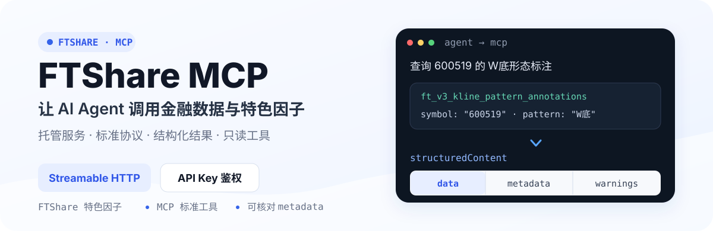

<p align="center">
  
</p>

<p align="center">
  <a href="README.md">中文</a> · <a href="README_EN.md">English</a>
</p>

<p align="center">
  
  
  
  <a href="https://github.com/FTShare-Lab/FTShare-MCP/blob/main/LICENSE"></a>
</p>

<p align="center">
  <strong>让金融数据成为 AI 的可靠上下文。</strong><br>
  FTShare MCP 让支持 MCP 的 AI 客户端，通过自然语言调用基础金融数据与 FTShare 特色因子。
</p>

<p align="center">
  <a href="https://ftai.chat/?tab=ft-share"><strong>FTShare 正式版</strong></a>
  · <a href="https://ftai.chat/me/profile">获取 API Key</a>
  · <a href="#60-秒接入">快速接入</a>
  · <a href="https://github.com/FTShare-Lab/FTShare-MCP/issues">问题反馈</a>
</p>

> [!IMPORTANT]
> 本仓库提供 MCP 工具文档、参数说明和接入示例，不包含 MCP Server 源码。公共 MCP 服务由 FTShare 托管，使用前需要配置 `FTSHARE_API_KEY`。

## FTShare MCP 是什么

FTShare MCP 是面向 AI Agent 的只读金融数据 MCP 服务。Claude Code、Codex 及其他支持 Streamable HTTP MCP 的客户端，可以把自然语言问题转换为标准工具调用，并获得结构化、可核对的结果。

<p align="center">
  <a href="https://ftai.chat/?tab=ft-share"></a>
</p>

<p align="center"><sub>FTShare 正式版公开页面。点击图片进入产品与套餐页面。</sub></p>

## 60 秒接入

### 1. 获取 API Key

登录 [FTShare 账号中心](https://ftai.chat/me/profile)，获取当前账号的 API Key。

请求 FTShare MCP 时使用以下 HTTP Header：

```text
FTSHARE_API_KEY: YOUR_FTSHARE_API_KEY
```

请勿将真实 API Key 提交到 Git 仓库、Issue、日志或公开截图。

### 2. 配置客户端

#### Claude Code

```bash
claude mcp add --transport http --scope user \
  --header "FTSHARE_API_KEY: YOUR_FTSHARE_API_KEY" \
  ftshare https://market.ft.tech/gateway/mcp
```

进入 Claude Code 后输入 `/mcp`，确认 `ftshare` 已连接。

#### Codex

在 `~/.codex/config.toml` 中加入：

```toml
[mcp_servers.ftshare]
url = "https://market.ft.tech/gateway/mcp"
http_headers = { FTSHARE_API_KEY = "YOUR_FTSHARE_API_KEY" }
```

保存后执行：

```bash
codex mcp get ftshare
```

配置变更后新开一个 Codex 任务，使工具定义重新加载。配置文件包含密钥，请勿公开提交。

#### 其他 MCP 客户端

- Transport：`Streamable HTTP`
- URL：`https://market.ft.tech/gateway/mcp`
- Header：`FTSHARE_API_KEY: YOUR_FTSHARE_API_KEY`

不同客户端的字段名称可能不同，请以对应客户端的自定义 HTTP Header 文档为准。

### 3. 提出一个特色数据问题

```text
使用 FTShare 查询 600519 的 W底形态标注
```

Agent 应选择以下真实工具与参数：

```json
{
  "tool": "ft_v3_kline_pattern_annotations",
  "arguments": {
    "symbol": "600519",
    "pattern": "W底",
    "page": 1,
    "page_size": 5
  }
}
```

> [!NOTE]
> 该工具的 `symbol` 使用纯 6 位代码，例如 `600519`，不要传入 `600519.SH`。特色因子属于研究数据，具体可用范围取决于账号套餐，不构成股票推荐或未来收益判断。

## 返回结果怎么读

成功结果位于 `result.structuredContent`：

```text
structuredContent
├── data                      业务数据
└── metadata
    ├── tool                  实际调用的工具
    ├── total / returned      总量与本次返回数量
    ├── pagination            分页信息
    ├── truncated             是否截断
    └── warnings              数据告警
```

应用和 Agent 不应只读取文本摘要，还要检查 `metadata.truncated`、分页状态和 `warnings`。业务错误会设置 `isError=true`，并返回结构化错误码。

## FTShare 的三种接入方式

| 接入方式 | 适合场景 | 调用形态 | 仓库 |
|---|---|---|---|
| **Python SDK** | Python 程序、数据分析、量化研究 | pandas `DataFrame`、Python rows、原始 JSON | [FTShare-python-sdk](https://github.com/FTShare-Lab/FTShare-python-sdk) |
| **MCP** | 支持 MCP 的 AI 客户端与 Agent | 标准 MCP 工具、结构化结果 | 当前仓库 |
| **Skill** | Claude Code、Codex、OpenClaw 等 Agent 运行时 | 自然语言到数据接口的路由 | [FTShare-skill](https://github.com/FTShare-Lab/FTShare-skill) |

三种方式连接同一套 FTShare 金融数据服务。MCP 负责标准化工具调用，Skill 负责自然语言到数据接口的路由。

## 当前服务

- **公共地址：** `https://market.ft.tech/gateway/mcp`
- **传输协议：** MCP Streamable HTTP
- **鉴权方式：** `FTSHARE_API_KEY` HTTP Header
- **工具属性：** 只读金融数据工具
- **实时工具定义：** 以 MCP `tools/list` 返回的名称、Schema 和 annotations 为准

服务版本、工具数量和账号权限会变化，因此不写入 Hero。发布说明与工具清单应在完成真实 `initialize → tools/list → tools/call` 验证后更新。

## 数据能力

- A 股行情、K 线、涨跌停、资金流、交易参考与公司数据
- ETF、指数、基金、期货、债券和贵金属
- 港股、美股、宏观经济、公告、研报和财经新闻
- FTShare 特色因子：新闻情绪因子、K 线形态标注、相关性 Top-K、信号快照等

## 数据目录

最新接口、参数、字段、数据权限和更新状态，请查看：

**[FTShare 最新数据接口文档](https://market.ft.tech/gateway/doc)**

当前文档目录覆盖：现货数据、宏观经济、大模型语料、股票数据、美股数据、公募基金、ETF 专题、港股数据、期货数据、债券专题和指数专题。

股票数据进一步包含资金流向、财务、参考、行情、打板专题、两融及转融通、特色数据和基础数据等分类；特色数据已包含 A 股新闻情绪因子、A 股相关性 Top-K、K 线形态标注、供应链关系和信号最新快照等能力。

工具数量、名称和参数以实时 `tools/list` 为准。仓库文档用于解释能力与示例，不替代服务端 Schema。

## 协议调用顺序

直接调用 MCP 协议时：

```text
initialize
    ↓ 获取 Mcp-Session-Id
notifications/initialized
    ↓
tools/list
    ↓
tools/call
```

后续请求需要携带初始化返回的 Session ID、协商后的 MCP 协议版本和 `FTSHARE_API_KEY`。

## 常见错误

| 错误码 | 含义 | 建议 |
|---|---|---|
| `MISSING_PARAMETER` | 缺少必填参数 | 对照实时 `inputSchema` 补充参数 |
| `INVALID_TYPE` | 参数类型错误 | 检查日期、代码和分页字段类型 |
| `UNKNOWN_PARAMETER` | 使用了未声明参数 | 删除 Schema 中不存在的字段 |
| `INVALID_ARGUMENT` | 参数值不满足约束 | 检查日期格式、代码格式和分页上限 |
| `UPSTREAM_REJECTED` | 上游或套餐拒绝请求 | 查看结构化错误信息，核对套餐与接口权限 |
| `UPSTREAM_UNAVAILABLE` | 上游服务暂时不可用 | 根据 `retryable` 与 warnings 判断是否稍后重试 |

## 社区与反馈

- 使用问题与功能建议：[GitHub Issues](https://github.com/FTShare-Lab/FTShare-MCP/issues)
- 正式产品与套餐：[FTShare](https://ftai.chat/?tab=ft-share)
- API Key 管理：[账号中心](https://ftai.chat/me/profile)
- Python SDK：[FTShare-python-sdk](https://github.com/FTShare-Lab/FTShare-python-sdk)
- Agent Skill：[FTShare-skill](https://github.com/FTShare-Lab/FTShare-skill)

### 加入 FTShare 社区交流群

欢迎加入 FTShare 社区交流群，讨论 MCP 接入、特色因子、金融数据接口、Skill 和 Agent 使用。

<p align="center">
  
</p>

> 群内用于交流使用经验和补充问题信息；Bug、功能需求和工具文档问题建议优先通过 GitHub Issues 提交。

**二维码有效期至 2026 年 9 月 18 日。** 如二维码失效，请在 Issues 中留言。

## License

本仓库文档和示例采用 MIT License。开源许可证不自动包含 FTShare 托管数据服务的访问额度、数据授权、再分发权或商业数据使用权。

---

<p align="center"><strong>FTShare</strong> · 让金融数据成为 AI 的可靠上下文</p>
