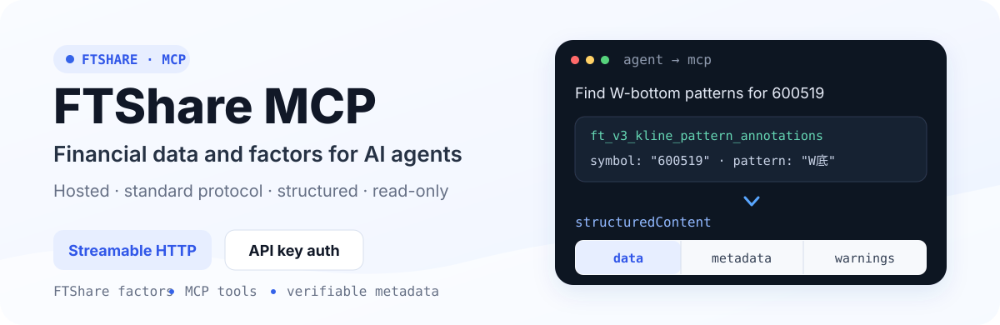

<p align="center">
  
</p>

<p align="center">
  <a href="README.md">中文</a> · <a href="README_EN.md">English</a>
</p>

<p align="center">
  
  
  
  <a href="https://github.com/FTShare-Lab/FTShare-MCP/blob/main/LICENSE"></a>
</p>

<p align="center">
  <strong>Reliable financial context for AI.</strong><br>
  FTShare MCP lets MCP-compatible AI clients call financial data and FTShare factor tools through natural language.
</p>

<p align="center">
  <a href="https://ftai.chat/?tab=ft-share"><strong>FTShare</strong></a>
  · <a href="https://ftai.chat/me/profile">Get an API key</a>
  · <a href="#connect-in-60-seconds">Connect</a>
  · <a href="https://github.com/FTShare-Lab/FTShare-MCP/issues">Issues</a>
</p>

> [!IMPORTANT]
> This repository contains MCP tool documentation, parameter references, and integration examples. It does not contain the MCP server source. FTShare hosts the public service, and requests require the `FTSHARE_API_KEY` header.

## What is FTShare MCP?

FTShare MCP is a hosted, read-only financial-data service for AI agents. Claude Code, Codex, and other Streamable HTTP MCP clients can turn natural-language questions into standard tool calls and receive structured, verifiable results.

<p align="center">
  <a href="https://ftai.chat/?tab=ft-share"></a>
</p>

<p align="center"><sub>FTShare's public product page is currently in Chinese. Click the image to open it.</sub></p>

## Connect in 60 seconds

### 1. Get an API key

Sign in to the [FTShare account center](https://ftai.chat/me/profile) and obtain the API key for your account.

Every request uses this HTTP header:

```text
FTSHARE_API_KEY: YOUR_FTSHARE_API_KEY
```

Never commit a real API key to Git, issues, logs, or public screenshots.

### 2. Configure a client

#### Claude Code

```bash
claude mcp add --transport http --scope user \
  --header "FTSHARE_API_KEY: YOUR_FTSHARE_API_KEY" \
  ftshare https://market.ft.tech/gateway/mcp
```

Run `/mcp` in Claude Code and confirm that `ftshare` is connected.

#### Codex

Add the following to `~/.codex/config.toml`:

```toml
[mcp_servers.ftshare]
url = "https://market.ft.tech/gateway/mcp"
http_headers = { FTSHARE_API_KEY = "YOUR_FTSHARE_API_KEY" }
```

Then verify the configuration:

```bash
codex mcp get ftshare
```

Start a new Codex task after changing the configuration so tool definitions reload. The config contains a secret and must not be committed publicly.

#### Other MCP clients

- Transport: `Streamable HTTP`
- URL: `https://market.ft.tech/gateway/mcp`
- Header: `FTSHARE_API_KEY: YOUR_FTSHARE_API_KEY`

Field names vary by client. Follow that client's documentation for custom HTTP headers.

### 3. Ask a factor-data question

```text
Use FTShare to find W-bottom pattern annotations for 600519.
```

The agent should select this real tool and input shape:

```json
{
  "tool": "ft_v3_kline_pattern_annotations",
  "arguments": {
    "symbol": "600519",
    "pattern": "W底",
    "page": 1,
    "page_size": 5
  }
}
```

> [!NOTE]
> `symbol` is a plain six-digit code for this tool, such as `600519`; do not pass `600519.SH`. Factor data is research data, may depend on plan entitlements, and is not an investment recommendation or prediction of future returns.

## Reading results

Successful business results live in `result.structuredContent`:

```text
structuredContent
├── data                      business data
└── metadata
    ├── tool                  tool actually called
    ├── total / returned      total and returned rows
    ├── pagination            pagination state
    ├── truncated             whether results were truncated
    └── warnings              data warnings
```

Applications and agents should inspect `metadata.truncated`, pagination, and `warnings`, not just the text summary. Business errors set `isError=true` and return a structured error code.

## Three ways to use FTShare

| Access method | Best for | Interaction | Repository |
|---|---|---|---|
| **Python SDK** | Python apps, data analysis, quantitative research | pandas `DataFrame`, Python rows, raw JSON | [FTShare-python-sdk](https://github.com/FTShare-Lab/FTShare-python-sdk) |
| **MCP** | MCP-compatible AI clients and agents | Standard MCP tools and structured results | This repository |
| **Skill** | Agent runtimes such as Claude Code, Codex, and OpenClaw | Natural-language routing to data interfaces | [FTShare-skill](https://github.com/FTShare-Lab/FTShare-skill) |

All three connect to the same FTShare financial-data service. MCP standardizes tool calls; Skill routes natural-language intent to data interfaces.

## Current service

- **Public endpoint:** `https://market.ft.tech/gateway/mcp`
- **Transport:** MCP Streamable HTTP
- **Authentication:** `FTSHARE_API_KEY` HTTP header
- **Tool behavior:** read-only financial-data tools
- **Live definitions:** use MCP `tools/list` for current names, schemas, and annotations

Service versions, tool counts, and account entitlements change over time, so they are not embedded in the hero. Release notes and inventories should be updated only after a real `initialize → tools/list → tools/call` verification.

## Data coverage

- A-share quotes, candlesticks, limit pools, capital flows, reference data, and company data
- ETFs, indices, funds, futures, bonds, and bullion
- Hong Kong and US equities, macro data, announcements, research, and financial news
- FTShare factors, including news sentiment, K-line pattern annotations, related-company Top-K, and signal snapshots

## Data directories

For the latest interfaces, parameters, fields, entitlements, and update status, use the official documentation:

**[Latest FTShare data documentation](https://market.ft.tech/gateway/doc)**

The current documentation covers spot data, macroeconomics, LLM corpora, A-share data, US equities, public funds, ETFs, Hong Kong equities, futures, bonds, and indices.

The A-share section is further organized into capital flows, financial statements, reference data, market data, limit-up topics, margin and securities lending, factor and characteristic data, and basic data. Characteristic data includes A-share news sentiment factors, related-company Top-K, K-line pattern annotations, supply-chain relationships, and the latest signal snapshots.

Use live `tools/list` as the source of truth for tool names, counts, and parameters. Repository documents explain capabilities and examples; they do not replace the server schema.

## Protocol sequence

For direct protocol calls:

```text
initialize
    ↓ receive Mcp-Session-Id
notifications/initialized
    ↓
tools/list
    ↓
tools/call
```

Subsequent requests must include the session ID, negotiated MCP protocol version, and `FTSHARE_API_KEY`.

## Common errors

| Code | Meaning | What to do |
|---|---|---|
| `MISSING_PARAMETER` | A required input is missing | Check the live `inputSchema` |
| `INVALID_TYPE` | An input has the wrong type | Check date, symbol, and pagination types |
| `UNKNOWN_PARAMETER` | An undeclared field was supplied | Remove fields not present in the schema |
| `INVALID_ARGUMENT` | An input violates a constraint | Check formats and page-size limits |
| `UPSTREAM_REJECTED` | The upstream service or entitlement rejected the request | Read the structured error and check plan access |
| `UPSTREAM_UNAVAILABLE` | The upstream service is temporarily unavailable | Inspect `retryable` and warnings before retrying |

## Community and support

- Questions and feature requests: [GitHub Issues](https://github.com/FTShare-Lab/FTShare-MCP/issues)
- Product and plans: [FTShare](https://ftai.chat/?tab=ft-share)
- API key management: [Account center](https://ftai.chat/me/profile)
- Python SDK: [FTShare-python-sdk](https://github.com/FTShare-Lab/FTShare-python-sdk)
- Agent Skill: [FTShare-skill](https://github.com/FTShare-Lab/FTShare-skill)

### Join the FTShare community

<p align="center">
  
</p>

Use GitHub Issues for bugs, feature requests, and documentation problems so they remain trackable. The QR code is valid through September 29, 2026.

## License

Documentation and examples in this repository use the MIT License. The license does not automatically grant hosted-service quota, data rights, redistribution rights, or commercial data usage rights.

---

<p align="center"><strong>FTShare</strong> · Reliable financial context for AI</p>
